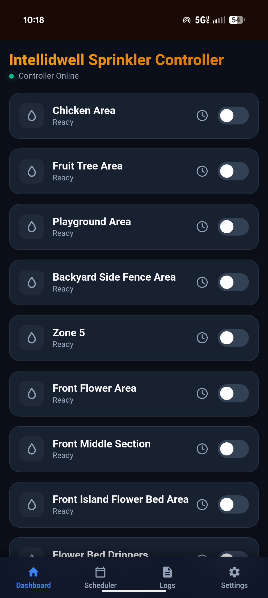
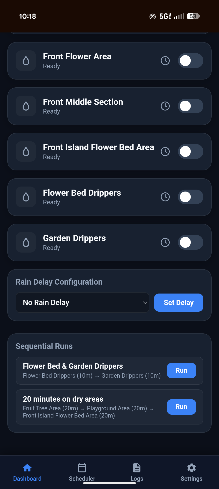
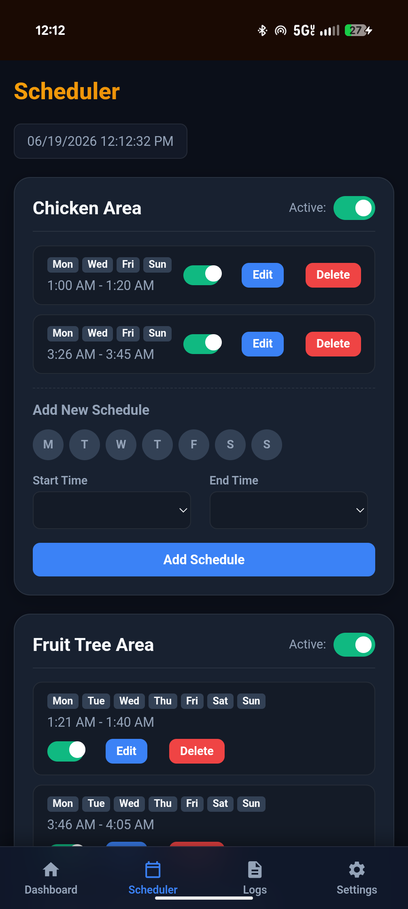
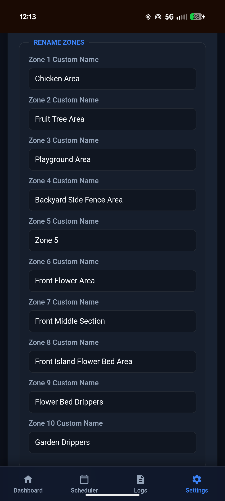
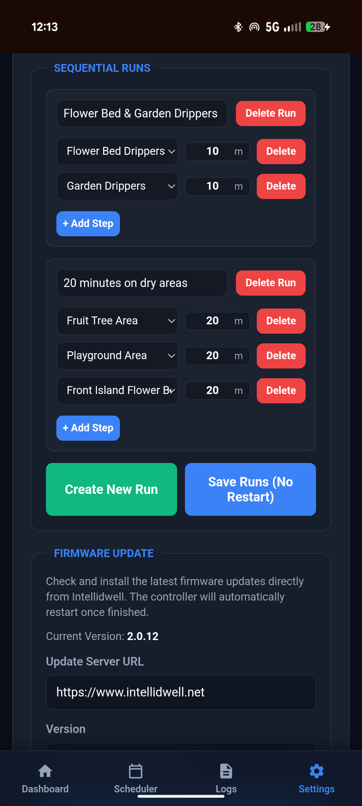
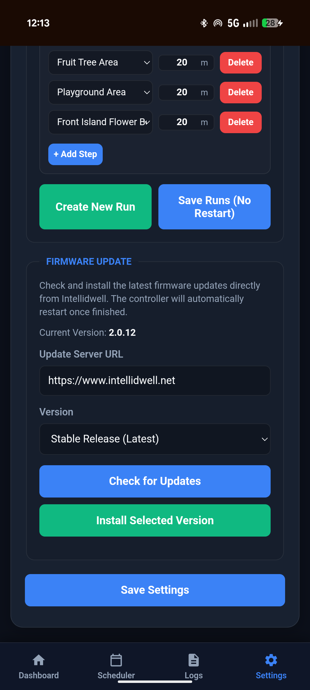
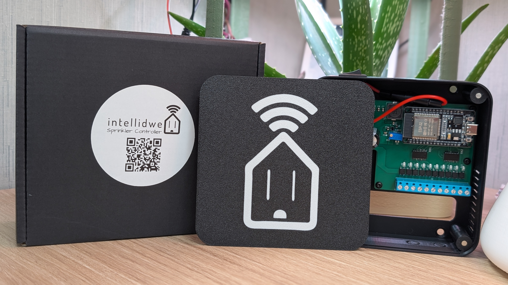
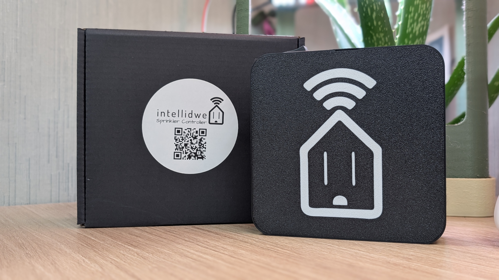
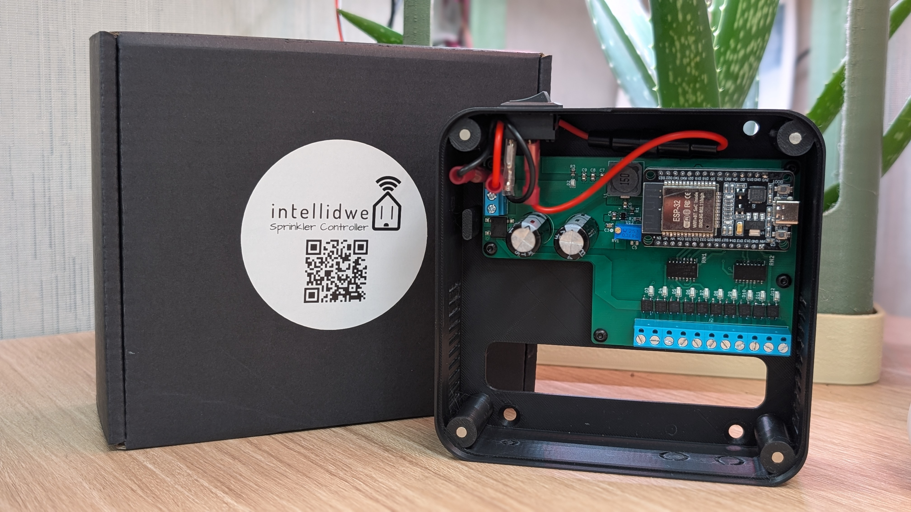
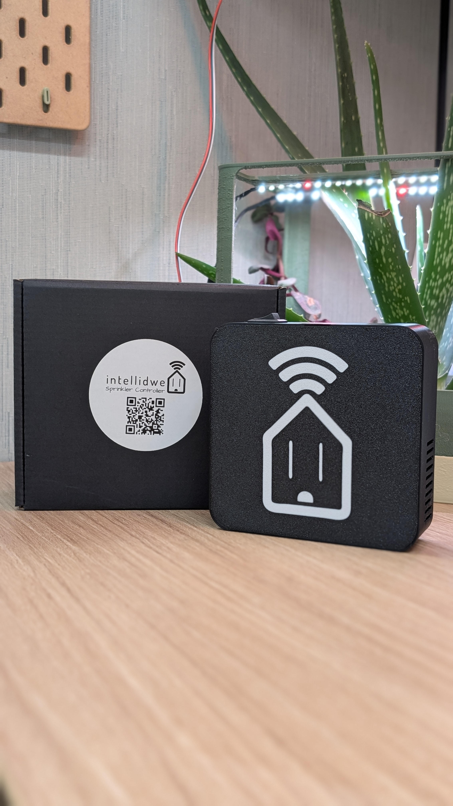

# 🏠 Intellidwell Smart Sprinkler Controller Firmware

This repository contains the open-source firmware for the **Intellidwell ESP32-Based Smart Sprinkler Controller**, developed by Tanner Nelson. It is designed to run on ESP32 microcontrollers and provides a responsive, local-first web interface, per-zone scheduling, MQTT telemetry integration, and multi-zone support with rain delay logic.

This code powers the official Intellidwell controller hardware, which is available for purchase. It is released for educational purposes, hobbyists, and developers who wish to contribute to or adapt the project for **personal** and **non-commercial** use.

---

## 🚫 Licensing and Usage

This project is licensed under the [GNU General Public License v3 (GPLv3)](https://www.gnu.org/licenses/gpl-3.0.en.html), **with additional restrictions on commercial use of this code in hardware products**.

### In Plain English:
*   ✅ **You can** view, modify, and run the code for personal projects.
*   ✅ **You can** fork the project and share improvements (as long as they remain open-source under the GPLv3).
*   ❌ **You may NOT** manufacture, sell, or distribute hardware products that use this code or its derivatives without express written permission from the author.

*The intent is to support open development and tinkering while protecting against commercial knockoffs.*

If you are interested in commercial licensing, please contact Tanner Nelson at [tanner.nelson@intellidwell.net](mailto:tanner.nelson@intellidwell.net).

---

## 📺 Web User Interface

The controller hosts a responsive, dark-mode web console directly on the ESP32 chip, allowing for seamless management from any device on your local network.

<p align="center">
  
  
</p>
<p align="center">
  
  
</p>
<p align="center">
  
  
</p>

---

## 🔧 Features & Architecture

*   **10-Zone Control + Master Valve**: Supports up to 10 independent 24VAC zone solenoids with configurable master valve pre-delay (1000ms) to prevent water hammer and current brownouts.
*   **Local-First & Private**: Operates entirely on your local network. No internet access or cloud subscriptions required.
*   **MQTT Auto-Discovery**: Integrates with Home Assistant automatically out-of-the-box using standard MQTT discovery protocols.
*   **NTP Time Sync**: Automatically synchronizes system clock via NTP with localized time zone and US DST calculations.
*   **Serialize requests (Concurrency Protection)**: Queues HTTP API calls to maintain stability and prevent browser socket exhaustion on ESP32.
*   **Background Wi-Fi Health Monitor**: Spawns a background worker thread to continuously audit connection health and resolve hostname/DNS loss.
*   **AP Fallback Mode**: If Wi-Fi goes down, the controller hosts a local access point (`intelidwellSC`) to allow local recovery.

---

## 📦 Enclosure & Hardware Layout

The V2 architecture separates the high-voltage mains AC transformer from the low-voltage logic, featuring a sleek wall-mount casing with a magnetic quick-access faceplate.

<p align="center">
  
  
</p>
<p align="center">
  
  
</p>

---

## 🚀 Flashing & Installation Guide

For developers building their own units or flashing custom boards:

### 1. Flash MicroPython onto the ESP32
Ensure your ESP32 board is connected to your computer via USB.
1. Install `esptool`:
   ```bash
   pip install esptool
   ```
2. Erase the ESP32 flash memory:
   ```bash
   esptool.py --chip esp32 --port /dev/ttyUSB0 erase_flash
   ```
3. Write the generic MicroPython binary (v1.22+ recommended):
   ```bash
   esptool.py --chip esp32 --port /dev/ttyUSB0 --baud 460800 write_flash -z 0x1000 ESP32_GENERIC-latest.bin
   ```

### 2. Upload Firmware Files to the Board
Upload all project files to the root directory of the ESP32 using `ampy` or `mremote`:
```bash
pip install adafruit-ampy

# Core logic & bootstrap
ampy --port /dev/ttyUSB0 put main.py
ampy --port /dev/ttyUSB0 put controller.py

# Networking & server libraries
ampy --port /dev/ttyUSB0 put microdot.py
ampy --port /dev/ttyUSB0 put microdot_asyncio.py

# Frontend assets
ampy --port /dev/ttyUSB0 put index.html
ampy --port /dev/ttyUSB0 put scheduler.html
ampy --port /dev/ttyUSB0 put logs.html
ampy --port /dev/ttyUSB0 put settings.html

# Configuration storage defaults
ampy --port /dev/ttyUSB0 put settings.json
```

### 3. Initial Configuration
1. Reboot the controller board.
2. Search for the Wi-Fi access point named **`intelidwellSC`** and connect using password **`Sprinkler12345`**.
3. Open a web browser and go to `http://192.168.4.1`.
4. Enter your home Wi-Fi SSID, password, and optional MQTT Broker details. Click **Connect**.
5. Once rebooted, access the dashboard at `http://sprinklers.local` (or the IP address assigned by your router).

---

## 💻 Local REST API Endpoints

The controller provides a lightweight REST API for automation scripts and third-party integrations:

*   **`GET /api/status`**: Returns JSON telemetry including relay states, active timer counts, and sequential run queue steps.
*   **`GET /relay/<zone_index>/<on_or_off>`**: Toggles a zone manually (`on` or `off`). E.g., `GET /relay/0/on`.
*   **`GET /relay-timer/<zone_index>/<duration_minutes>`**: Runs a timed zone cycle.
*   **`GET /cancel-timer/<zone_index>`**: Halts active timed cycle and shuts off zone solenoid.
*   **`GET /set-rain-delay/<days>`**: Disables scheduled tasks for the specified duration.
*   **`POST /restart`**: Triggers soft system reboot.

---

## 🤝 Support & Contribution

Official hardware casing kits, pre-assembled PCBs, and support details are available at the [Intellidwell Store](https://intellidwell.net). For direct help or inquiries, contact us at [support@intellidwell.net](mailto:support@intellidwell.net).
